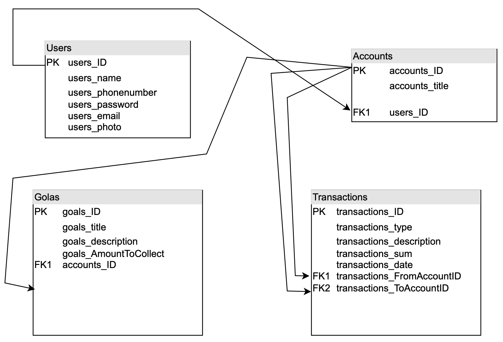
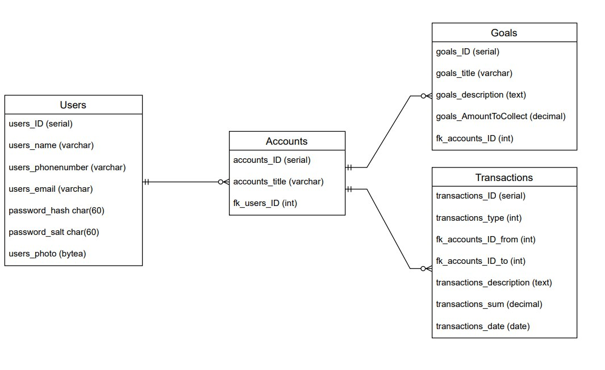

# Money Manager

Money Manager is a simple and intuitive desktop application designed to help you keep track of your budget and finances. Our application will help you control expenses, income and achieve financial goals. It is suitable for both advanced users and beginners, thanks to its user-friendly and simple interface.

Refer to [DOCUMENTS/Presentation.pptx](DOCUMENTS/Presentation.pptx) for presentation on this application, to [DOCUMENTS/PresentationWireframes.pptx](DOCUMENTS/PresentationWireframes.pptx) for presentation on wireframes, and to [DOCUMENTS/usecase.pptx](DOCUMENTS/usecase.pptx) for functionality. 

## Main features:

- Intuitive interface: Our app has a clear and easy-to-use interface, making it accessible to all users.

- Security and privacy: We provide a high level of protection for your personal and financial data.

- Data visualisation: Take a look at your finances with interactive graphs and charts that give you quick insights.

- Goal setting and alerts: Set financial goals and get notifications when you reach them to help you stay motivated.

- Overspend alerts: Get notified if you try to spend more than you planned.

- Automatic forecasting: Our app analyses your transaction history to predict future income and expenses.

- Risk and opportunity analysis: Get advice on possible financial risks and opportunities based on your financial situation.

## Requirements
### Non-functional Requirements
+ Interface language: English
+ Operating system: Windows 7 or newer
+ Database: PostgreSQL

### Security Requirements
+ Vulnerability Protection:
    + The software code should be free of vulnerabilities such as buffer overflows, SQL injections, and other attacks.

+ Authentication and Authorization:
    + Ensure reliable user authentication.

## Implementation
Database setup script: [DOCUMENTS/Script.sql](DOCUMENTS/Script.sql)
### ER diagram

### UML diagram

## Window Descriptions
### "Registration" Window
This window is for user registration or logging into an existing account. The login form includes the following fields: telephone number and password. If the user wants to register, the form will also include a Username field. After logging in or registering, the user is automatically redirected to the home page.

### "Home" Window
The home page will display the user's current balance and a small list of recent transactions tied to the current account. Below this list, there will be a "see more" button that redirects to the full list of transactions. The name of the account will be displayed at the top. There will also be an "Add transaction" button to make a new transaction on a specific account.

### "My profile" Window
This is where the user can change their personal information and set a profile avatar. It will include "Security settings", "Edit profile", and "Log out" buttons.

### "Security" Window
In this window, the user can change their phone number or password for their account.

### "My goals" Window
Here, the user can view their financial goals, see what percentage they have completed, and add or delete new goals. By clicking the "see more" button, the user can see detailed information about a specific goal.

### <GoalName> Window
This window provides detailed information about a goal, including a progress bar showing how much of the goal is complete, a description, and the account it is set on.

### "Transactions" Window
The user sees a list of all transactions. A filter can be applied to show transactions for a specific account. There will be a "delete" button to remove a specific transaction, as well as a "Make transaction" button.

### "Make transaction" Window
In this window, the user can add new transactions for expenses, income, or transfers between accounts. There will be three buttons, one for each transaction type. An optional description can be added to the transaction. Each transaction type will have its own corresponding form.

### "Statistics" Window
This window will display an income/expense chart. A dropdown menu will allow the user to select the chart type (e.g., Line graph, Bar graph). The user can also specify a date range for the chart.

### "Accounts" Window
The user can view all existing accounts with brief information about each one. If the user wants a specific account to be displayed on the "Home" screen, they can click the "Choose it" button. There will also be a button to create a new account, which will bring up a form with an "Account Name" field. Accounts can also be deleted, but only if they have a zero balance.

### Nice to have
"Statistics" Window: The user can compare two different charts. For example, a comparison of expense and income charts for September and August. For each chart, a list of recent transactions corresponding to that chart will be displayed.

## Team
+ Vitalii Kozienko
+ Ostap Melnyk
+ Andriy Kravets
+ Yaroslav Revera